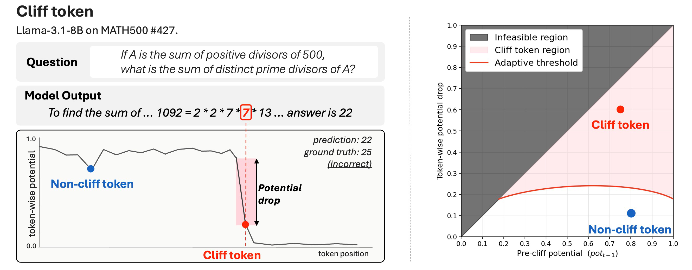
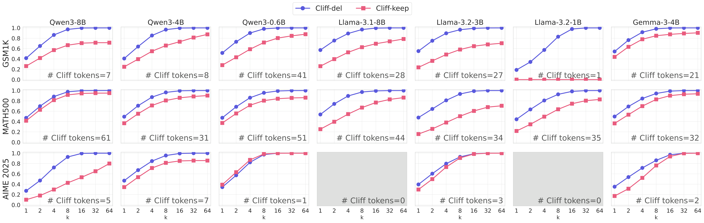

# 🧗 Cliff Tokens

Official reproduction code for **Cliff Tokens: Identifying Single-Token Failure Triggers in LLM Mathematical Reasoning**.

<p align="center">
  
</p>

This work identifies the **precise token** that triggers a trace-level shift toward failure. We call this token a **cliff token**: a token where the **token-wise potential** drops significantly under an adaptive threshold based on a one-sided two-proportion z-test.


---

## 🔍 Paper in Brief

- **Token-Wise Potential.** The probability that a reasoning process reaches the correct answer, given the partial trace up to token position `t`.
- **Cliff Token.** A token whose rollout-estimated potential drops significantly under the adaptive threshold `Δ_t > 0.1 + 1.645 · SE_t`.
- **RQ1. Failure Trigger.** Cliff tokens occur more often in incorrect traces; deleting the first cliff token (`Cliff-del`) restores reasoning more reliably than continuing from it (`Cliff-keep`).
- **RQ2. Cliff Taxonomy.** Cliff tokens are categorized by greedy choice and token entropy into deterministic, uncertain, and sampled-off cliffs.
- **RQ3. Family and Scale Effects.** Deterministic cliffs are largely scale-invariant, uncertain cliffs expose model-specific knowledge gaps, and sampled-off cliffs show scale-asymmetry.
- **Cliff-DPO.** Single-token preference optimization at cliff positions improves reasoning when trained on uncertain and sampled-off cliffs, while deterministic cliffs are less effective.

<p align="center">
  
</p>

**RQ1. Failure Trigger** experiment compares continuing from the first cliff token (`Cliff-keep`) against deleting it and resuming generation (`Cliff-del`), showing that failures are often recoverable from a single cliff-token deletion.

---

## ✨ What This Repo Reproduces

- **Cliff Token Detection** from generated mathematical reasoning traces
- **Token-Wise Potential** estimation with rollout sampling
- **Adaptive Z-Test Thresholding** for statistically significant potential drops
- **Cliff Taxonomy** into deterministic, uncertain, and sampled-off cases
- **CPM Shift Analysis** across model families and scales
- **Cliff-DPO** data construction, training, and evaluation
- **Paper Figures** from preserved PDFs and regenerable figure code

---

## 📦 Repository Layout

```text
.
├── src/                 # core Python package
├── scripts/             # experiment entrypoints
├── figure/              # figure notebooks, reduced data, generated figures
├── paper_images/        # exact PDF images used in the paper
├── requirements.txt     # tested Python/CUDA dependency pins
├── README.md
└── LICENSE
```

Generated artifacts are intentionally ignored by git:

```text
model/        # downloaded model weights
data/input/   # downloaded datasets and generated subsets
output/       # inference, rollout, analysis, and training outputs
```

## 🗂️ Output Layout

Experiment outputs are named in paper-reproduction order. Wrappers use these paths by default unless `--output_dir` or the corresponding input root is provided.

```text
output/
├── 01_inference/                # sampled reasoning traces
├── 02_token_stats/              # per-token logprob/rank/entropy stats
├── 03_rollout/                  # token-wise potential rollout outputs
├── 04_cliff_occurrence/         # cliff occurrence and taxonomy summaries
├── 05_deletion_ablation/        # Cliff-del / Cliff-keep pass@k results
├── 06_entropy_rank/             # entropy/rank analyses around cliffs
├── 07_candidate_replacement/    # candidate replacement at cliff positions
├── 08_cpm_shift/                # cross-model cliff probability mass shift
└── 09_cliff_dpo/
    ├── 01_candidates/           # top-k candidate rollout at cliff positions
    ├── 02_pairs/                # cliff-position preference pairs
    ├── 03_training/             # trained Cliff-DPO adapters
    ├── 04_eval/                 # adapter evaluation outputs
    ├── 05_cliff_count/          # post-training cliff-count evaluation
    └── logs/
```

---

## 🛠️ Env Setup

Tested with Python 3.10, CUDA 12.x, NVIDIA driver 535+, PyTorch 2.6, and vLLM 0.8.4.

```bash
git clone <repo-url> cliff-token-code
cd cliff-token-code

conda create -n cliff python=3.10 -y
conda activate cliff
pip install -r requirements.txt
```

For gated Llama/Gemma models:

```bash
export HF_TOKEN=hf_xxx
```

Select the GPU used for generation, rollout, and training:

```bash
export GPU_IDS=7
export CUDA_VISIBLE_DEVICES=7
```

All generated artifacts stay inside repo-local `model/`, `data/input/`, and `output/` directories.

---

## 🚀 Quick Reproduction

### 1. Download Models

The paper evaluates seven instruction-tuned models across model families and scales.

```bash
python -m src.utils.download_models --hf_token "$HF_TOKEN"
```

Paper model aliases:

```text
qwen3-0.6b, qwen3-4b, qwen3-8b,
llama-3.2-1b, llama-3.2-3b, llama-3.1-8b,
gemma-3-4b
```

Download a smaller subset if needed:

```bash
python -m src.utils.download_models --model qwen3-0.6b qwen3-4b qwen3-8b
```

### 2. Download Datasets

The analysis uses GSM1K, MATH500, and AIME 2025. GSM8K is used for Cliff-DPO training.

```bash
python -m src.utils.download_datasets --dataset gsm1k math500 aime25
python -m src.utils.download_datasets --dataset gsm8k
```

### 3. Build Paper Subsets

The paper uses subsampling to make token-wise rollout analysis computationally feasible.

```bash
python -m src.utils.create_subsets --seed 42
```

This creates:

- `gsm1k_100`: 100 GSM1K problems sampled with seed 42
- `math500_100`: 100 MATH500 problems, level-stratified with seed 42
- `aime25`: all 30 AIME 2025 problems

---

## 🧠 Core Pipeline

### 4. Generate Reasoning Traces

Generate one sampled trace per model-problem pair for the cliff-token analysis.

```bash
bash scripts/run_inference.sh \
  --model qwen3-0.6b \
  --dataset gsm1k_100,math500_100,aime25 \
  --gpus "$GPU_IDS" \
  --output_dir output/01_inference
```

Run all paper models sequentially on one GPU:

```bash
for model in qwen3-0.6b qwen3-4b qwen3-8b llama-3.2-1b llama-3.2-3b llama-3.1-8b gemma-3-4b; do
  bash scripts/run_inference.sh \
    --model "$model" \
    --dataset gsm1k_100,math500_100,aime25 \
    --gpus "$GPU_IDS" \
    --output_dir output/01_inference
done
```

Optional token-level logprob/rank/entropy stats for taxonomy and entropy analyses:

```bash
python3 scripts/_compute_token_stats.py \
  --gpu "$GPU_IDS" \
  --source output/01_inference \
  --output_dir output/02_token_stats \
  --skip-existing
```

### 5. Estimate Token-Wise Potential

Estimate token-wise potential with rollout sampling. The paper uses `N=64` rollouts per token position and early termination after irrecoverable potential-zero regions.

```bash
bash scripts/run_rollout.sh \
  --model qwen3-0.6b \
  --dataset gsm1k_100 \
  --data_path output/01_inference/Qwen3-0.6B/gsm1k_100_all_paths.json \
  --rollout_samples 64 \
  --gpus "$GPU_IDS" \
  --output_dir output/03_rollout/Qwen3-0.6B
```

Repeat rollout for each model/dataset pair you want to analyze.

### 6. Analyze Cliff Tokens

RQ1: cliff occurrence and failure-trigger behavior.

```bash
bash scripts/run_exp1_occurrence.sh \
  --rollout_dir output/03_rollout \
  --datasets gsm1k_100,math500_100,aime25 \
  --output_dir output/04_cliff_occurrence/paper
```

Cliff-del vs. Cliff-keep pass@k ablations:

```bash
bash scripts/run_exp1_deletion.sh \
  --rollout_dir output/03_rollout \
  --datasets gsm1k_100,math500_100,aime25 \
  --gpus "$GPU_IDS" \
  --output_dir output/05_deletion_ablation/paper_batch
```

RQ2: entropy/rank behavior and cliff taxonomy:

```bash
bash scripts/run_exp3_entropy.sh \
  --rollout_dir output/03_rollout \
  --baseline_dir output/02_token_stats \
  --datasets gsm1k_100,math500_100,aime25 \
  --gpus "$GPU_IDS" \
  --output_dir output/06_entropy_rank/paper_batch
```

RQ2/RQ3: candidate replacement and cross-model cliff probability mass shift:

```bash
bash scripts/run_exp4_candidates_all_models.sh \
  --gpus "$GPU_IDS" \
  --parallel_mode auto

bash scripts/run_exp5_cpm_shift.sh \
  --sources qwen3-0.6b,qwen3-8b \
  --evals qwen3-0.6b,qwen3-8b \
  --datasets gsm1k_100,math500_100,aime25 \
  --gpus "$GPU_IDS" \
  --output_dir output/08_cpm_shift/qwen_small_big_batch
```

---

## 🧗 Cliff-DPO

Cliff-DPO is single-token preference optimization at identified cliff positions. It applies a DPO-style objective only to candidate tokens at the cliff position, comparing a non-cliff candidate token against the original cliff token at the same prefix.

### 1. Candidate Rollout

At each cliff position, evaluate top-k candidate tokens by rollout-estimated token-wise potential.

```bash
bash scripts/run_dpo_rollout.sh \
  --model qwen3-0.6b \
  --dataset gsm8k \
  --data_path output/03_rollout/Qwen3-0.6B/gsm8k_all_paths.json \
  --gpus "$GPU_IDS" \
  --k_candidates 10 \
  --num_samples 64
```

### 2. Build Preference Pairs

```bash
python -m src.dpo.build_dpo_pairs \
  --candidates_path output/09_cliff_dpo/01_candidates/Qwen3-0.6B/gsm8k_cliff_candidates.json \
  --output_dir output/09_cliff_dpo/02_pairs/Qwen3-0.6B \
  --strategy cliff_1N \
  --category_ablations
```

### 3. Train

Train the five paper Cliff-DPO variants: deterministic, uncertain, sampled-off, uncertain+sampled-off, and all.

```bash
bash scripts/run_dpo_train.sh \
  --suite \
  --model ./model/Qwen3-0.6B \
  --dataset gsm8k \
  --gpus "$GPU_IDS" \
  --wandb_mode disabled
```

### 4. Evaluate

```bash
python -m src.dpo.evaluate \
  --model ./model/Qwen3-0.6B \
  --adapter_paths none \
    output/09_cliff_dpo/03_training/Qwen3-0.6B/gsm8k/cliff_all \
    output/09_cliff_dpo/03_training/Qwen3-0.6B/gsm8k/cliff_deterministic_only \
    output/09_cliff_dpo/03_training/Qwen3-0.6B/gsm8k/cliff_uncertainty_only \
    output/09_cliff_dpo/03_training/Qwen3-0.6B/gsm8k/cliff_sampled_off_only \
    output/09_cliff_dpo/03_training/Qwen3-0.6B/gsm8k/cliff_uncertainty_sampled_off_only \
  --labels Baseline Cliff-all Cliff-deterministic Cliff-uncertainty Cliff-sampled-off Cliff-uncertainty-sampled-off \
  --datasets gsm8k gsm1k_100 math500_100 aime25 \
  --gpus "$GPU_IDS"
```

---

## 🖼️ Figures

Two figure paths are included:

- 📄 `paper_images/`: exact PDFs used in the paper
- 📊 `figure/`: notebook, reduced data, and generated PNG/PDF outputs

Regenerate figures:

```bash
jupyter nbconvert --to notebook --execute figure/figure_revision.ipynb \
  --output figure_revision.executed.ipynb \
  --ExecutePreprocessor.timeout=-1
```

---


## 📄 License

The code in this repository is released under the MIT License; see `LICENSE`.

Downloaded model weights, datasets, and benchmark contents are governed by their original upstream licenses and terms of use. In particular, Llama and Gemma require accepting their HuggingFace license terms before download.

---

## 📚 Citation

```bibtex
@article{clifftokens2026,
  title = {Cliff Tokens: Identifying Single-Token Failure Triggers in LLM Mathematical Reasoning},
  year = {2026}
}
```
