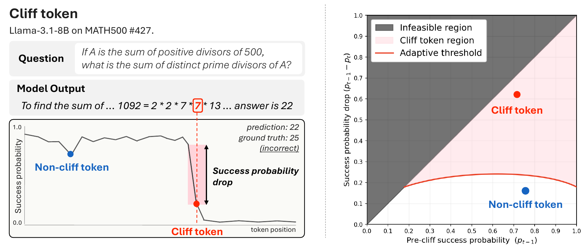
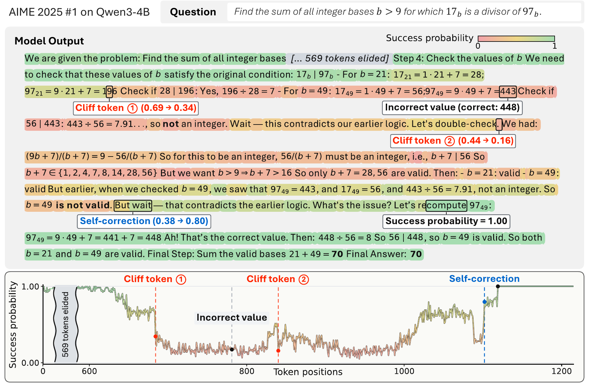

<div align="center">

# Cliff Tokens: Analyzing Failure Trigger Tokens in LLM Mathematical Reasoning

📃 [Paper Link (arXiv)](https://arxiv.org/abs/2606.25524)&nbsp;&nbsp;🌐 [Project Page](https://jaeyongko.github.io/cliff-token/)

**Jaeyong Ko**¹, **Jinu Lee**², **Pilsung Kang**¹, **Yukyung Lee**³†

¹Seoul National University, ²University of Illinois Urbana-Champaign, ³Boston University

†Corresponding author

</div>

<p align="center">
  
</p>

## Abstract

Large language models reach high accuracy in mathematical reasoning, but individual traces on the same problem diverge; some arrive at the correct answer while others fail. Prior work localizes such failures at the step, chunk, or sentence level, or identifies tokens where failure has already occurred. These approaches leave open which token triggers failure. We introduce the **cliff token**, a token at which the estimated probability of reaching the correct answer (success probability) drops beyond an adaptive threshold. Across seven models and three mathematical reasoning benchmarks (GSM1K, MATH500, AIME 2025), cliff tokens act as failure triggers. For incorrect traces containing cliff tokens, we compare resampling immediately before and after the first cliff token. Resampling before it shows higher pass@k at the same sample count. We further introduce a cliff taxonomy of deterministic, uncertain, and sampled-off cliffs, defined by greedy choice and token entropy. Additionally, we show that the three types differ as training signals. Using single-token preference optimization at cliff positions (Cliff-DPO), we find that uncertain and sampled-off cliffs show larger accuracy gains than deterministic cliffs on three of the four evaluation benchmarks. We release token-level rollout data and source code to enable further analysis without regenerating costly rollouts.


## Paper in Brief

- **Cliff tokens as failure triggers (§4).** We identify tokens where the estimated probability of reaching the correct answer drops beyond a z-test based adaptive threshold. Resampling before the first cliff token generally yields higher pass@k than resampling after it. Cliff tokens need not coincide with error tokens, and a trace can recover through self-correction.
- **Three cliff types (§5).** We distinguish deterministic, uncertain, and sampled-off cliffs by token entropy and whether the token is the greedy choice. Their proportions vary across model families and sizes.
- **Different training signals (§6).** Under single-token preference optimization at cliff positions (Cliff-DPO), uncertain and sampled-off cliffs yield larger accuracy gains than deterministic cliffs, to which the models already assign near-certain probabilities.

We release token-level rollout data to support further research on LLM reasoning.

<p align="center">
  
</p>

<div align="center">
<sub><i>Figure 4. A correct Qwen3-4B trace for AIME 2025 Problem 1 contains two cliff tokens. Success probability drops at both tokens, then recovers after the model corrects its reasoning.</i></sub>
</div>

## Setup

```bash
git clone https://github.com/beaver-22/Cliff-token.git
cd Cliff-token
```
```bash
conda create -n cliff python=3.10 -y
conda activate cliff
pip install -r requirements.txt
```

Downloading the released traces requires no model downloads. For GPU analyses, new model runs, or evaluation, download the models and benchmark datasets. Llama and Gemma require access to their gated Hugging Face repositories.

```bash
export GPU_IDS=0
export HF_TOKEN=hf_xxx  # only for gated models
python -m src.utils.download_models --hf_token "$HF_TOKEN"
python -m src.utils.download_datasets --dataset gsm1k math500 aime25 gsm8k
python -m src.utils.create_subsets --seed 42
```

## Released Data

Download the stem traces and rollouts as uncompressed JSON from the [Hugging Face dataset](https://huggingface.co/datasets/Beaverdam/cliff-token-data):

```bash
python scripts/download_release_data.py --repo-id Beaverdam/cliff-token-data
```

For analyses that need token rank or entropy, compute them from the released traces:

```bash
python scripts/_compute_token_stats.py --gpu 0
```

## Analysis

**Figure 2.** Cliff tokens per trace in correct vs. incorrect traces.

```bash
bash scripts/run_exp1_occurrence.sh \
  --rollout_dir output/03_rollouts \
  --datasets gsm1k_100,math500_100,aime25 \
  --output_dir output/04_cliff_occurrence/paper
# -> avg_cliff_tokens.json, cliff_stats_all_models.csv
```

**Figure 3.** Cliff-del / Cliff-keep resampling (64 samples each) at every cliff token; pass@k at the first cliff token of each incorrect trace.

```bash
bash scripts/run_exp1_deletion.sh \
  --rollout_dir output/03_rollouts \
  --datasets gsm1k_100,math500_100,aime25 \
  --gpus "$GPU_IDS" \
  --output_dir output/05_deletion_ablation/paper
# -> pass_at_k_first_cliff_incorrect.csv
```

**Figure 4.** Self-correcting trace (Qwen3-4B, AIME 2025 Problem 1).

```bash
python scripts/build_self_correction_case.py --rollout_dir output/03_rollouts
# -> figure/data/fig4_self_correction/trace.json, figure/output/fig4_self_correction.pdf
```

**Table 1.** Cliff type distribution over cliff tokens and over all stem-trace tokens.

```bash
bash scripts/run_exp3_taxonomy.sh \
  --rollout_dir output/03_rollouts \
  --baseline_dir output/02_token_stats \
  --datasets gsm1k_100,math500_100,aime25 \
  --gpus "$GPU_IDS" \
  --output_dir output/06_cliff_taxonomy/paper
# -> cliff_type_distribution.csv
```

`figure/figure.ipynb` draws Figures 1–4 from `figure/data/`.


## 🧗 Cliff-DPO

Base models: `llama-3.1-8b`, `llama-3.2-1b`, `qwen3-0.6b`. The released GSM8K training rollouts already provide the input for preference-pair construction. The commands below use Qwen3-0.6B.

### 1. Candidate Rollout

Top-10 candidate tokens at each cliff position, 64 rollouts per candidate.

```bash
bash scripts/run_dpo_rollout.sh \
  --model qwen3-0.6b \
  --dataset gsm8k_train \
  --data_path output/03_rollouts/Qwen3-0.6B/gsm8k_train_all_paths.json \
  --gpus "$GPU_IDS" \
  --k_candidates 10 \
  --num_samples 64
# -> output/07_cliff_dpo/01_candidates/Qwen3-0.6B/gsm8k_train_cliff_candidates.json
```

### 2. Build Preference Pairs

Rejected = cliff token; chosen = each candidate that does not satisfy the cliff criterion. Pairs are split by the cliff type of the rejected token.

```bash
python -m src.dpo.build_dpo_pairs \
  --candidates_path output/07_cliff_dpo/01_candidates/Qwen3-0.6B/gsm8k_train_cliff_candidates.json \
  --output_dir output/07_cliff_dpo/02_pairs/Qwen3-0.6B
# -> cliff_{deterministic,uncertainty,sampled_off}_only_gsm8k_train.json
```

### 3. Train

Three variants (deterministic, uncertain, sampled-off) × seeds 42, 43, 44. Learning rate: `1e-6` for Llama-3.1-8B, `5e-6` for Llama-3.2-1B and Qwen3-0.6B.

```bash
bash scripts/run_dpo_train.sh \
  --suite \
  --model ./model/Qwen3-0.6B \
  --dataset gsm8k_train \
  --seeds 42,43,44 \
  --lr 5e-6 \
  --gpus "$GPU_IDS"
# -> output/07_cliff_dpo/03_training/Qwen3-0.6B/gsm8k_train/cliff_<variant>_only_seed<seed>
```

### 4. Evaluate

GSM8K (test), GSM1K, MATH500: greedy accuracy. AIME 2025: avg@64 with the model's sampling configuration. The base model is evaluated three times; each adapter is evaluated once per training seed.

```bash
bash scripts/run_dpo_eval.sh \
  --model ./model/Qwen3-0.6B \
  --dataset gsm8k_train \
  --gpus "$GPU_IDS"
# -> output/07_cliff_dpo/04_eval/Qwen3-0.6B/{base_run1,base_run2,base_run3,cliff_dpo}/
```

### 5. Cliff-Token Probability Shift

Teacher-forced probability of each held-out cliff token (GSM1K, MATH500, AIME 2025 stem traces) under the base model and each adapter; each variant is measured on cliffs of its own type.

```bash
python scripts/run_cliff_prob_shift.py --model ./model/Qwen3-0.6B --dataset gsm8k_train --gpu 0
python scripts/_cliff_prob_shift_aggregate.py --root output/07_cliff_dpo/05_cliff_prob_shift
# -> output/07_cliff_dpo/05_cliff_prob_shift/cliff_prob_shift.csv
```

### Token-Matched Ablation

The uncertain and sampled-off pair sets are subsampled to the size of the deterministic set (sampling seeds 42 and 43). The deterministic variant from step 3 is used as is.

```bash
python scripts/prepare_token_matched_pairs.py \
  --pairs_dir output/07_cliff_dpo/02_pairs/Qwen3-0.6B \
  --dataset gsm8k_train
# -> cliff_{uncertainty,sampled_off}_only_token_matched_gsm8k_train.json

bash scripts/run_dpo_train.sh \
  --suite \
  --model ./model/Qwen3-0.6B \
  --dataset gsm8k_train \
  --variants uncertainty,sampled_off \
  --variant_suffix _token_matched \
  --lr 5e-6 \
  --gpus "$GPU_IDS"

bash scripts/run_dpo_eval.sh \
  --model ./model/Qwen3-0.6B \
  --dataset gsm8k_train \
  --variants uncertainty,sampled_off \
  --variant_suffix _token_matched \
  --base_runs 0 \
  --gpus "$GPU_IDS"
```


## 📄 License

Code: MIT (`LICENSE`). Released data include benchmark problems and model outputs; their original dataset licenses and model terms of use still apply.

Llama and Gemma require accepting their HuggingFace license terms before download.


## 📚 Citation

```bibtex
@article{ko2026clifftoken,
  title={Cliff Tokens: Analyzing Failure Trigger Tokens in LLM Mathematical Reasoning},
  author={Ko, Jaeyong and Lee, Jinu and Kang, Pilsung and Lee, Yukyung},
  journal={arXiv preprint arXiv:2606.25524},
  year={2026},
  eprint={2606.25524},
  archivePrefix={arXiv}
}
```
